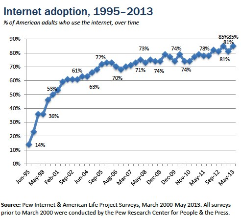

==============================
Computer Networking Timeline
==============================

Internet Adoption
=================

Internet Timeline
=================

1969
-----

ARPA (Advanced Research Projects Agency) goes online in December, connecting four major U.S. universities. Designed for research, education, and government organizations, it provides a communications network linking the country in the event that a military attack destroys conventional communications systems.

1972
----

Electronic mail is introduced by Ray Tomlinson, a Cambridge, Mass., computer scientist. He uses the @ to distinguish between the sender's name and network name in the email address.

1973
-----

Transmission Control Protocol/Internet Protocol (TCP/IP) is designed and in 1983 it becomes the standard for communicating between computers over the Internet. One of these protocols, FTP (File Transfer Protocol), allows users to log onto a remote computer, list the files on that computer, and download files from that computer.

1976
-------

Presidential candidate Jimmy Carter and running mate Walter Mondale use email to plan campaign events.

Queen Elizabeth sends her first email. She's the first state leader to do so.

1982
-----

The word “Internet” is used for the first time.

1984
----

Domain Name System (DNS) is established, with network addresses identified by extensions such as .com, .org, and .edu.

Writer William Gibson coins the term “cyberspace.”

1985
----
    
Quantum Computer Services, which later changes its name to America Online, debuts. It offers email, electronic bulletin boards, news, and other information.

1988
-----

A virus called the Internet Worm temporarily shuts down about 10% of the world's Internet servers.

1989
-----
The World (world.std.com) debuts as the first provider of dial-up Internet access for consumers.

Tim Berners-Lee of CERN (European Laboratory for Particle Physics) develops a new technique for distributing information on the Internet. He calls it the World Wide Web. The Web is based on hypertext, which permits the user to connect from one document to another at different sites on the Internet via hyperlinks (specially programmed words, phrases, buttons, or graphics). Unlike other Internet protocols, such as FTP and email, the Web is accessible through a graphical user interface.

1990
------

The first effort to index the Internet is created by Peter Deutsch at McGill University in Montreal, who devises Archie, an archive of FTP sites.

1991
-----

Gopher, which provides point-and-click navigation, is created at the University of Minnesota and named after the school mascot. Gopher becomes the most popular interface for several years.

Another indexing system, WAIS (Wide Area Information Server), is developed by Brewster Kahle of Thinking Machines Corp.

1993
----

Mosaic is developed by Marc Andreeson at the National Center for Supercomputing Applications (NCSA). It becomes the dominant navigating system for the World Wide Web, which at this time accounts for merely 1% of all Internet traffic.

1994
-----

The White House launches its website, www.whitehouse.gov.

Initial commerce sites are established and mass marketing campaigns are launched via email, introducing the term “spamming” to the Internet vocabulary.

Marc Andreessen and Jim Clark start Netscape Communications. They introduce the Navigator browser.

1995
-----

CompuServe, America Online, and Prodigy start providing dial-up Internet access.
    
Sun Microsystems releases the Internet programming language called Java.
    
The Vatican launches its own website, www.vatican.va.

1996
----

Approximately 45 million people are using the Internet, with roughly 30 million of those in North America (United States and Canada), 9 million in Europe, and 6 million in Asia/Pacific (Australia, Japan, etc.). 43.2 million (44%) U.S. households own a personal computer, and 14 million of them are online.

1997
-----

On July 8, 1997, Internet traffic records are broken as the NASA website broadcasts images taken by Pathfinder on Mars. The broadcast generates 46 million hits in one day.

The term “weblog” is coined. It’s later shortened to “blog.”

1998
-----

Google opens its first office, in California.

1999
----

College student Shawn Fanning invents Napster, a computer application that allows users to swap music over the Internet.

The number of Internet users worldwide reaches 150 million by the beginning of 1999. More than 50% are from the United States.

“E-commerce” becomes the new buzzword as Internet shopping rapidly spreads.

MySpace.com is launched.

2000
-------

To the chagrin of the Internet population, deviant computer programmers begin designing and circulating viruses with greater frequency. “Love Bug” and “Stages” are two examples of self-replicating viruses that send themselves to people listed in a computer user's email address book. The heavy volume of email messages being sent and received forces many infected companies to temporarily shut down their clogged networks.

The Internet bubble bursts, as the fountain of investment capital dries up and the Nasdaq stock index plunges, causing the initial public offering (IPO) window to slam shut and many dotcoms to close their doors.
    
America Online buys Time Warner for $16 billion. It’s the biggest merger of all time.

2001
--------

Napster is dealt a potentially fatal blow when the 9th U.S. Circuit Court of Appeals in San Francisco rules that the company is violating copyright laws and orders it to stop distributing copyrighted music. The file-swapping company says it is developing a subscription-based service.

About 9.8 billion electronic messages are sent daily.

Wikipedia is created.

2002
-------

As of January, 58.5% of the U.S. population (164.14 million people) uses the Internet. Worldwide there are 544.2 million users.

The death knell tolls for Napster after a bankruptcy judge ruled in September that German media giant Bertelsmann cannot buy the assets of troubled Napster Inc. The ruling prompts Konrad Hilbers, Napster CEO, to resign and lay off his staff.

2003
------
    
It's estimated that Internet users illegally download about 2.6 billion music files each month.

Spam, unsolicited email, becomes a server-clogging menace. It accounts for about half of all emails. In December, President Bush signs the Controlling the Assault of Non-Solicited Pornography and Marketing Act of 2003 (CAN-SPAM Act), which is intended to help individuals and businesses control the amount of unsolicited email they receive.

Apple Computer introduces Apple iTunes Music Store, which allows people to download songs for 99 cents each.

Apple Computer introduces Apple iTunes Music Store, which allows people to download songs for 99 cents each.

2004
-----

Internet Worm, called MyDoom or Novarg, spreads through Internet servers. About 1 in 12 email messages are infected.

Online spending reaches a record high—$117 billion in 2004, a 26% increase over 2003.

2005
------

YouTube.com is launched.

2006
-----
    
There are more than 92 million websites online.

2007
----
   
Legal online music downloads triple to 6.7 million downloads per week.

Colorado Rockies' computer system crashes when it receives 8.5 million hits within the first 90 minutes of World Series ticket sales.

The online game, World of Warcraft, hits a milestone when it surpasses 9 million subscribers worldwide in July.

2008
-----

In a move to challenge Google's dominance of search and advertising on the Internet, software giant Microsoft offers to buy Yahoo for $44.6 billion.

In a San Fransisco federal district court, Judge Jeffrey S. White orders the disabling of Wikileaks.org, a Web site that discloses confidential information. The case was brought by Julius Baer Bank and Trust, located in the Cayman Islands, after a disgruntled ex-employee allegedly provided Wikileaks with stolen documents that implicate the bank in asset hiding, money laundering, and tax evasion. Many web communities, who see the ruling as unconstitutional, publicized alternate addresses for the site and distributed bank documents through their own networks. In response, Judge White issues another order to stop the distribution of bank documents.

Microsoft is fined $1.3 billion by the European Commission for further abusing its dominant market position, and failing to comply to their 2004 judgment, which ordered Microsoft to give competitors information necessary to operate with Windows. Since 2004, Microsoft has been fined a total of $2.5 billion by the Commission for not adhering to their ruling. 

2012
------

A major protest online in January shakes up Congressional support for anti-Web piracy measures. The protest, including a 24-hour shutdown of the English-language Wikipedia site, is over two bills, the Stop Online Piracy Act in the House and the Protect IP Act in the Senate. The main goal of both bills is to stop illegal downloading and streaming of TV shows and movies online. The tech industry is concerned that the bills will give media companies too much power to shut down websites. 

2014
------

A coding error discovered in April in OpenSSL, encryption software that makes transactions between a computer and a remote secure, makes users vulnerable to having their usernames, passwords, and personal information stolen. Millions of banks, Internet commerce companies, email services, government sites, and social media sites rely on OpenSSL to conduct secure transactions. The coding error was made in 2012. Computer security experts encourage computer users to change their passwords. 

*Sources for this timeline include International Data Corporation, the W3C Consortium, Nielsen/NetRatings, and the Internet Society.*

*Information Please® Database, © 2014 Pearson Education, Inc. All rights reserved.*
